### **Cake Management System – A Java Swing-Based Project**

This project is a **Java Swing desktop application** designed to **simplify and automate the operations of a cake shop**. The tools and technologies used include:

- ✅ **Java Swing** – for building a user-friendly interface  
- ✅ **Apache NetBeans** – as the development environment

Through this system, the cake shop can:

- Efficiently manage the **product list (cakes available)**  
- **Take and track orders**  
- Store and manage **customer information**

💡 As a result, the shop can operate faster, reduce manual errors, and provide better service to customers.

---

This project reduces the dependency on manual paperwork by offering a **centralized system** that helps manage everything in one place, making business decision-making easier and more effective.

<h3>📸 Project Screenshots</h3>

  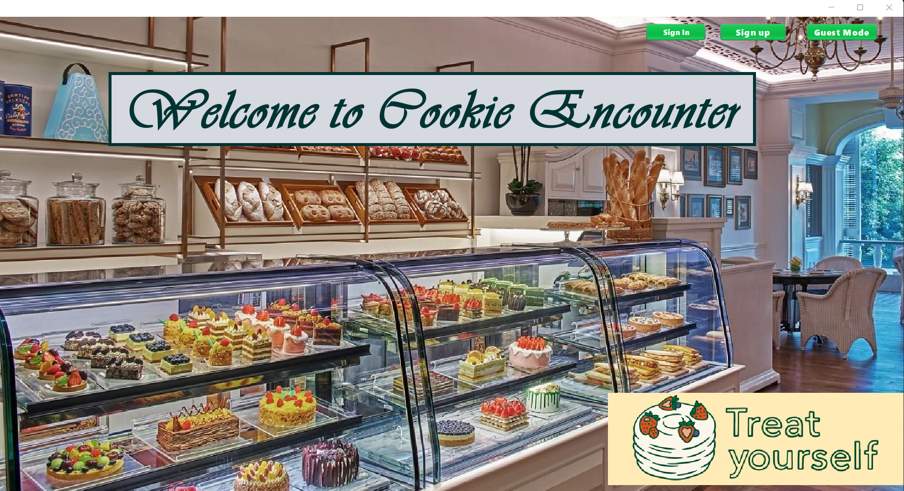
  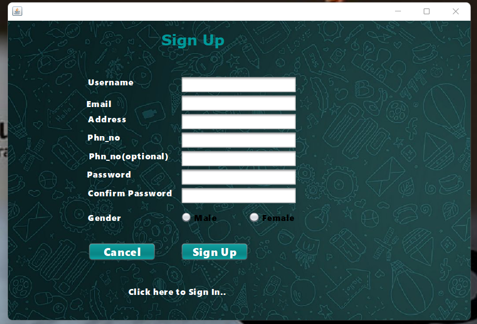
   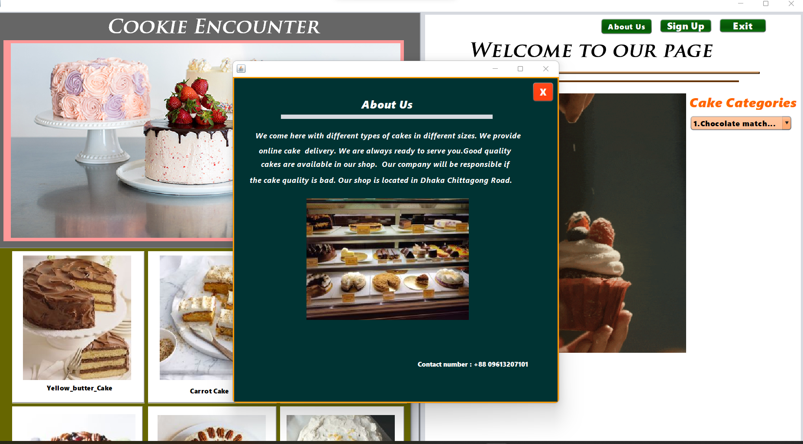
  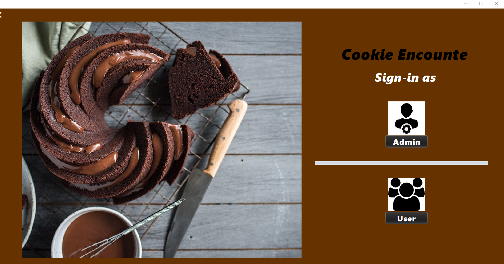
   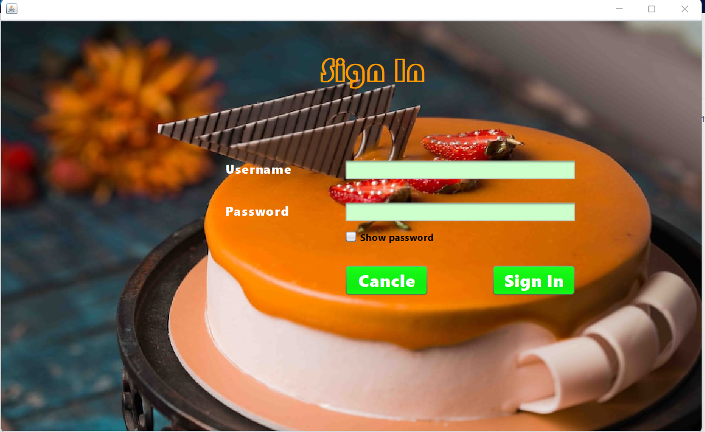
  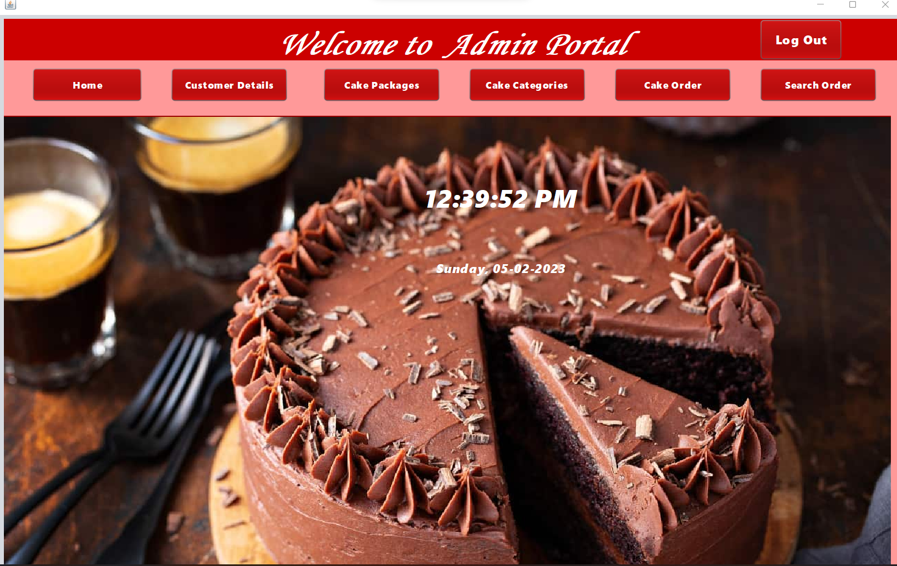
   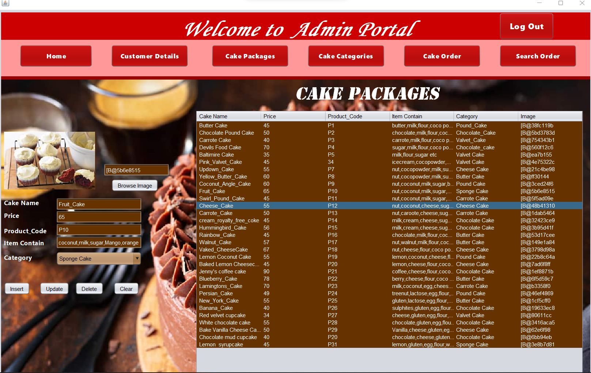
  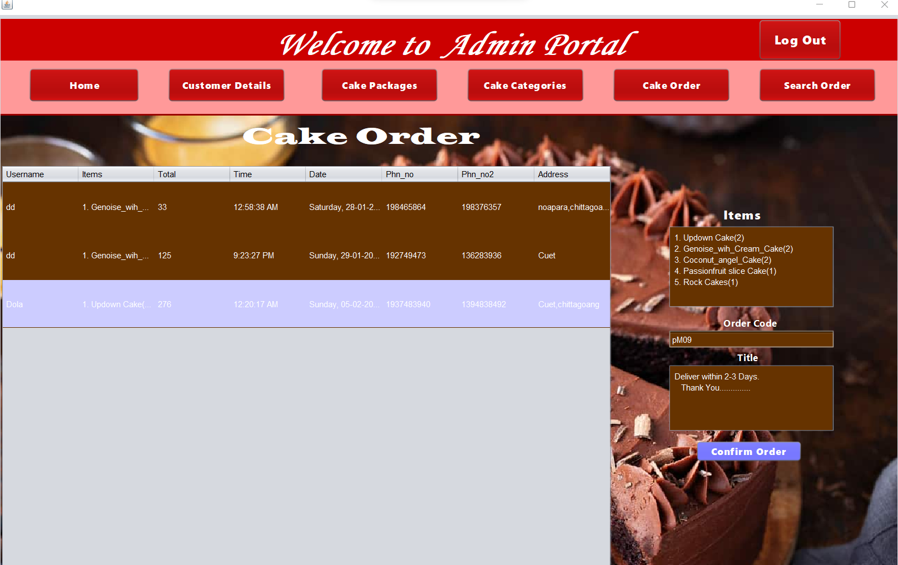
   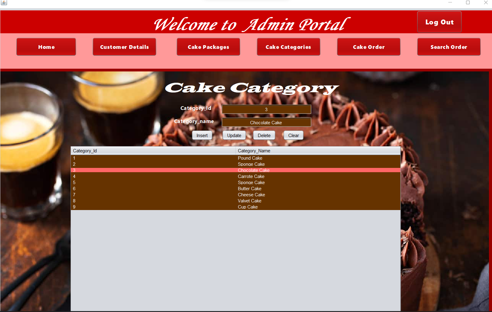
  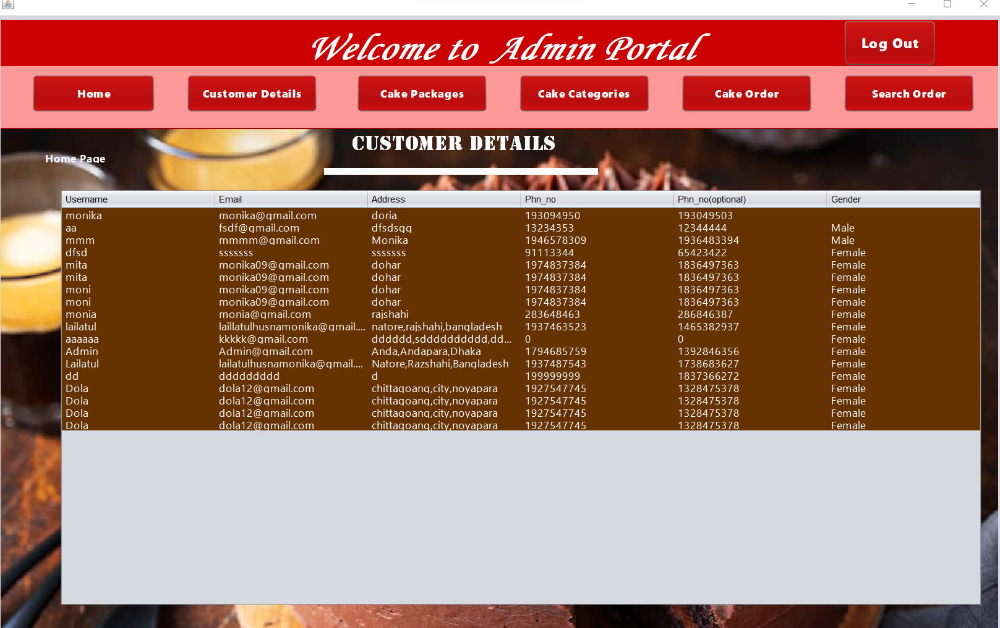
   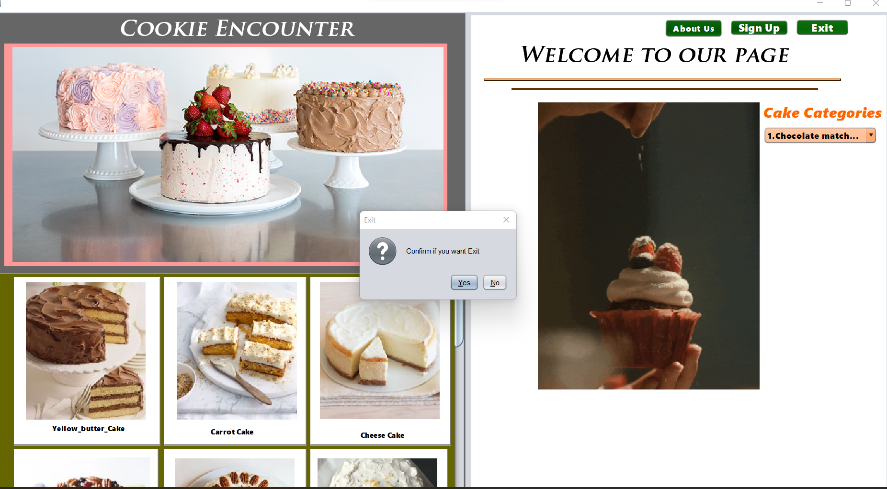
  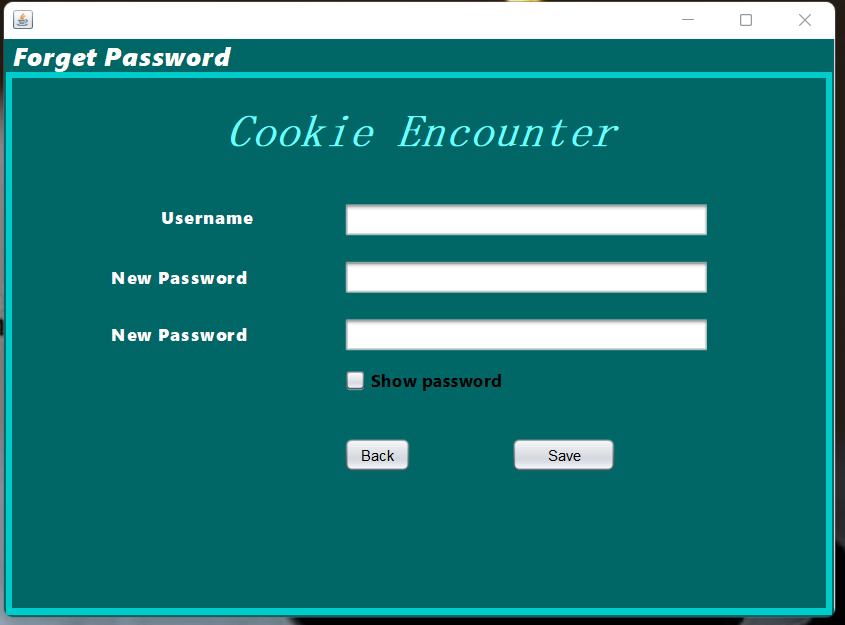
   
  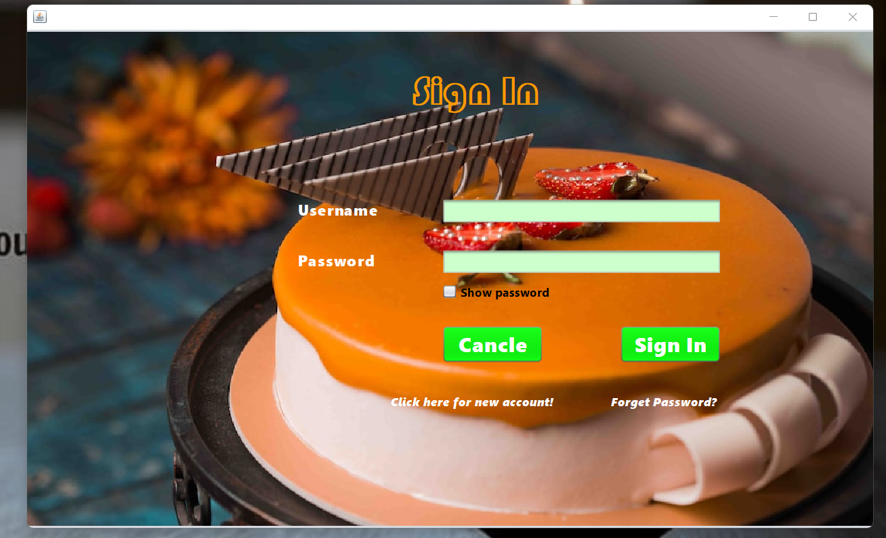
   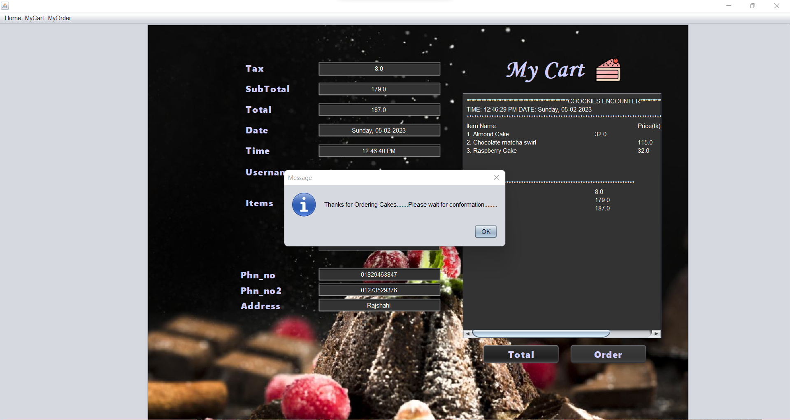
  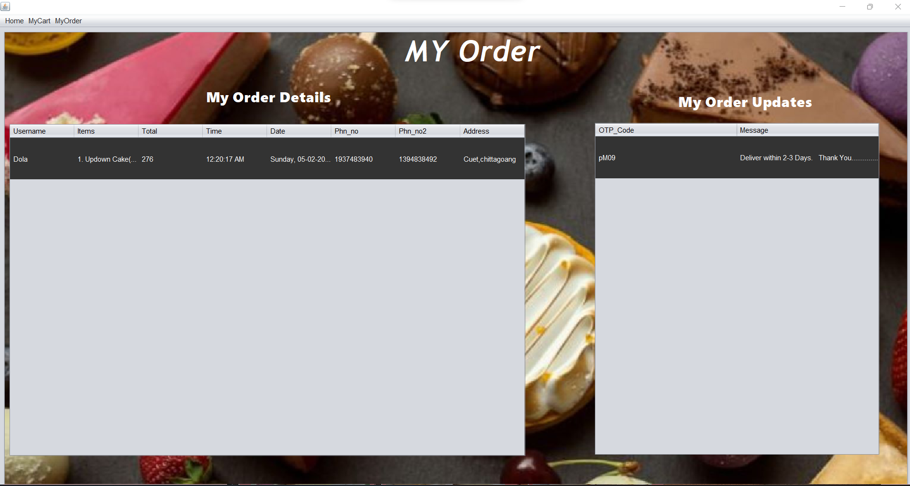
   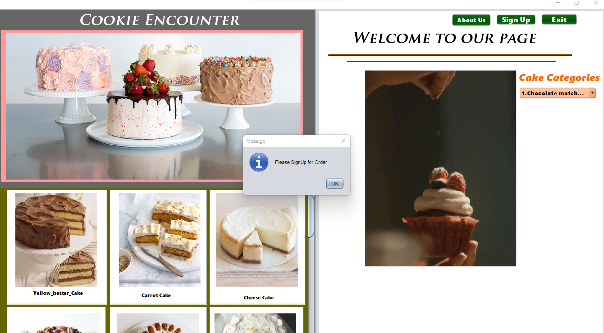
  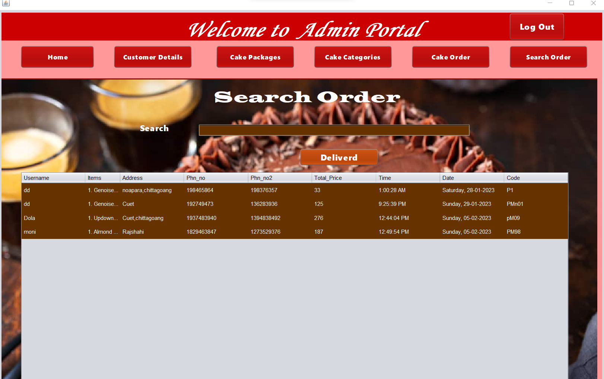
    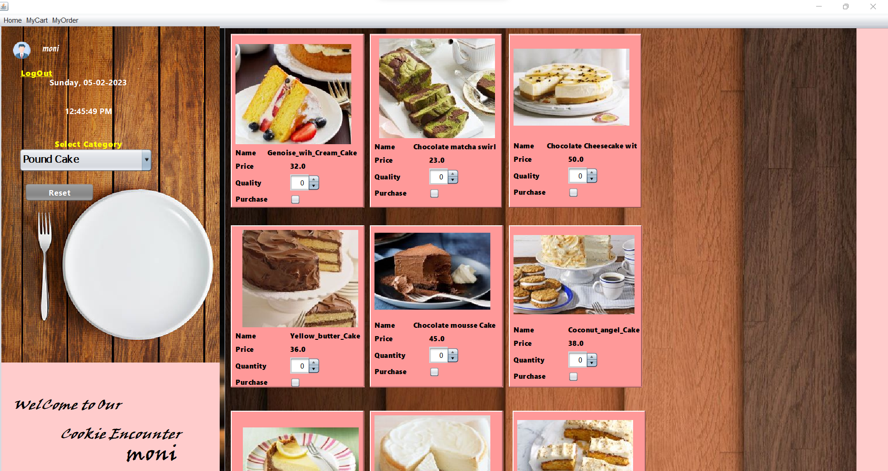

 

